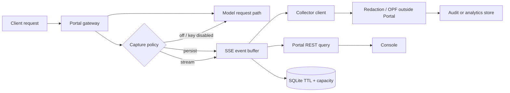

# Conversation Monitor 设计（#130）

> 状态：设计阶段 / prototype only。本文与 `console/static/conversation-monitor-prototype.html` 一起评审，尚未改变 Portal runtime、compat/console 路由或现有导航。日期：2026-09-26。

## 用户故事与对齐基线

基线来源：GitHub issue #130 与当前任务要求。`baseline_revision: #130-design-review`。

| ID | 用户故事 | Given / When / Then |
|---|---|---|
| CM-01 | As a Portal 管理员 / I want to 按 Key 选择性开启对话采集并设置保留策略 / So that 我能在成本和隐私风险可控时调查请求问题。 | Given capture 默认关闭；When 管理员选择 `stream`/`persist`、启用 Key 并设置 TTL/容量；Then 新请求按策略旁路采集，页面展示模式、Key、TTL、容量。 |
| CM-02 | As a collector/observability client / I want to 通过 SSE 获取事件并在客户端脱敏后消费 / So that Portal 不需要承载 OPF，同时我能建设审计或分析流水线。 | Given SSE client 已授权连接；When client 使用 `Last-Event-ID` 接收事件；Then client 可断点恢复、脱敏并消费，OPF/collector 失败不影响主请求。 |
| CM-03 | As a Portal 管理员 / I want to 查看实时流、筛选分页记录和单条详情 / So that 我能定位某个模型、协议、Key 或失败请求。 | Given capture 已开启且当前角色有权限；When 切换 tab、按时间/Key/模型/协议/状态筛选、翻页或点开记录；Then 展示结果与原始 request/response/tool call/usage。 |
| CM-04 | As a Portal 管理员 / I want to 看见 SSE 连接和采集健康指标，并暂停/恢复实时流 / So that 我能判断监控链路是否可用且不误判主请求状态。 | Given stream 正常或暂停；When 点击 pause/resume；Then UI 更新连接与 Live stream 状态，并明确采集丢弃不阻断模型请求。 |

约束：默认关闭；按 Key 选择；原文只对授权角色和 collector client 可见；采集失败不阻断主链路；TTL/容量有界；查询支持 REST/SSE；原型只用 mock data；不加入现有导航。

Non-goals：Portal 不内置 OPF；本任务不实现真实 runtime、REST/SSE handler、存储迁移或生产 rollout。

**设计 playback：** CM-01～CM-04 均有原型路径与文档证据，drift score 0，`DESIGN_ALIGNED`。

## 责任边界与架构



- **Portal 标准能力**：旁路创建原文事件；按 `off|stream|persist` 和 Key allowlist 决定采集；提供授权的 SSE 订阅、REST 查询、连接状态、TTL/容量清理。Portal 不调用 OPF。
- **SSE client**：通过 SSE 接收 Portal 原文事件；携带 `Last-Event-ID` 断点续传；收到后执行脱敏，再写入自己的审计或分析系统。
- **OPF**：外部能力，由 collector 或下游数据管线调用；只处理 client 副本，不属于 Portal runtime。
- **Console**：在现有“请求与用量”页面中消费 REST/SSE 结果。本设计不新增一级导航，复用现有请求明细的筛选、KPI、分页、详情抽屉和自动刷新；此 PR 只交付原型，不接生产 API。

### 信息架构决策

对话监控不单独占用侧栏一级菜单，而是作为“请求与用量”的第三个页签：

1. **用量趋势**：沿用现有请求数、输入/输出/cache token、TTFT 和总时延趋势；
2. **请求明细**：沿用现有逐请求筛选、游标分页和详情抽屉；
3. **对话监控**：新增采集健康度、SSE Live stream、原文记录和 Capture policy。

这样 Key、模型、协议、状态、时间范围和详情交互只有一套来源，避免为相同请求数据复制导航和筛选状态。原型侧栏选中“请求与用量”，页签选中“对话监控”。

### 与相邻任务的边界

| 任务 | 衔接 |
|---|---|
| #127 | 复用请求/执行上下文和错误语义；监控旁路观察，不改变执行路径。 |
| #128 | 复用 Key、模型、协议身份语义；本设计增加 capture policy 与原文访问状态，不重复 Key 管理。 |
| #62 | usage、model、protocol、status 可复用用量/明细维度；request/response/tool call 受独立 content access contract 约束。 |
| #106 | 复用主题、卡片、表格、chip、drawer、分页、响应式壳；不修改主题运行时。 |

## 原型说明

打开 `console/static/conversation-monitor-prototype.html` 可直接预览。它引用现有 `portal.css`，不加载 `portal.js`，不发起认证或 API 请求。

- **Overview**：`capture` 模式、SSE 状态、今日采集/原文可用/丢弃/容量/lag、Live stream、最近活动。
- **Records**：时间、Key、模型、协议、状态筛选；request id/model 搜索；分页、每页数量、详情抽屉。
- **Policy**：Portal capture `off|stream|persist`、原文访问权限、Key allowlist、retention TTL、capacity。
- **详情抽屉**：原始 request、response、tool calls、usage、latency、status；示例只使用 synthetic text。
- **SSE 控件**：Pause/Resume 只模拟 mock stream 状态；说明真实客户端使用 `Last-Event-ID`。

## 策略与生命周期

| 模式 | 新请求行为 | SSE | 持久化 |
|---|---|---|---|
| `off` | 不创建对话 payload 事件，只保留必要计数/错误指标 | 不发送内容事件 | 不写对话记录 |
| `stream` | 旁路创建事件，放入有界内存队列 | 发送给已授权 collector | 不写 SQLite；队列溢出计入 dropped |
| `persist` | 旁路创建事件 | 发送给已授权 collector | 写 SQLite，按 TTL/容量清理 |

`off` 是默认值。Key policy 先于 mode 生效，未启用 Key 等价于 `off`。运行时在请求完成后或旁路 worker 中 enqueue，禁止等待 SSE 或 SQLite。

### Collector-side OPF

Portal 发出的 envelope 和 Portal 详情接口在授权范围内包含原文。collector 收到 SSE 后立即调用 OPF，再把脱敏副本写入自己的 benchmark/replay 存储。OPF 失败只丢弃 collector 副本并上报 metric，Portal 不因 OPF 不可用而失败主请求。

### TTL 与容量

- 默认 TTL 14 天，可选 7/14/30 天；按 `created_at` 批量删除并记录数量。
- 默认容量 50,000 条，可选 10,000/50,000/100,000；到上限优先删除最老记录，删除/丢弃原因进入指标。
- SQLite 只存已允许持久化的 Portal 原文事件，数据库在受保护 volume；备份和导出遵循同一权限与审计策略。
- UI 对有权限的角色展示原文 request/response；Authorization、原始 Key、原始 IP 不进入 payload，Key 仍以 masked ref 展示。

## 事件与 API 草案

### Event envelope

```json
{
  "id": "evt_0001842",
  "request_id": "req_0001842",
  "created_at": "YYYY-MM-DDT10:42:16Z",
  "key_ref": "prod-app••••1a",
  "model": "model-alpha",
  "protocol": "openai-chat",
  "status": "ok",
  "capture_mode": "persist",
  "content_mode": "original|not-captured",
  "payload": {
    "request": "original request body",
    "response": "original response body",
    "tool_calls": [],
    "usage": {"input_tokens": 1024, "output_tokens": 818, "total_tokens": 1842},
    "latency_ms": 820
  }
}
```

禁止明文 Authorization、原始 Key 和不必要网络标识；prompt/response 原文只在明确授权的 Portal 查询和 SSE client 范围内出现。`key_ref` 是可轮换的展示引用；多租户场景在查询授权层绑定 tenant scope。

### REST

| 方法 | 路径 | 用途 | 约束 |
|---|---|---|---|
| GET | `/api/v1/conversation-monitor/summary` | 今日 captured/original/dropped/capacity/SSE lag | 管理员；tenant scope |
| GET | `/api/v1/conversation-monitor/records` | 分页记录 | `from,to,key,model,protocol,status,cursor,limit`；默认不返回 payload |
| GET | `/api/v1/conversation-monitor/records/{request_id}` | 单条详情 | 仅授权角色能看 Portal 原文 payload |
| GET | `/api/v1/conversation-monitor/policy` | 读取 mode、Key、TTL、capacity | 不返回 secret |
| PUT | `/api/v1/conversation-monitor/policy` | 更新 policy | 审计变更人和版本；只影响新请求 |

### SSE

- Endpoint：`GET /api/v1/conversation-monitor/stream`。
- Event types：`conversation.capture`、`conversation.drop`、`heartbeat`、`policy.changed`。
- 每条事件带 `id: evt_*`；重连发送 `Last-Event-ID`。服务端从有界 replay buffer 恢复；无法恢复时发 `reset`，client 再从 REST cursor 补齐。
- heartbeat 建议 15 秒，idle timeout 45 秒，单 client 有界队列 256 事件。队列满时只丢弃采集副本并计数，不反压主模型请求。

## 性能、错误与隐私

### 性能预算

| 项目 | 目标 |
|---|---:|
| 主链路新增同步开销 | p95 ≤ 2 ms；policy lookup、轻量 envelope、非阻塞 enqueue |
| SSE delivery lag | p95 ≤ 1 s；每 client 256 事件队列 |
| REST records 查询 | 50k 记录范围 p95 ≤ 300 ms；索引 `created_at/key_ref/model/status` |
| SQLite 清理 | 批量 job，单批 ≤ 500 条；不占请求线程 |
| Collector OPF | client 自己的预算，不进入 Portal SLA |

### 错误降级

1. policy/cache 读取失败：安全默认 `off`，记录 `capture_policy_error`，模型请求继续。
2. SSE client 断开：清理 client queue，记录 reconnect；不影响模型请求。
3. replay buffer 不覆盖 `Last-Event-ID`：发 `reset`，client 用 REST cursor 恢复。
4. SQLite 写失败或容量满：记录 `persist_dropped`，仍返回模型响应。
5. OPF 失败：collector 丢弃下游副本并报警；Portal 不参与脱敏，也不因 collector 失败而重试主请求。
6. 查询/详情鉴权失败：标准 401/403，不透露 Key、IP 或 payload 是否存在。

### 安全与可观测性

默认关闭、按 Key allowlist；策略变更写审计日志。详情、分页、导出都做角色和 tenant scope 检查。原文是敏感内容，只能通过授权 Portal 详情和 SSE client 传递；日志和 metric label 只使用 masked key、synthetic request id、有限集合枚举，禁止 Authorization 和原始 IP。建议 metrics：`conversation_capture_total{mode,key_ref}`、`conversation_content_events_total{mode}`、`conversation_dropped_total{reason}`、`conversation_sse_clients`、`conversation_sse_lag_ms`、`conversation_persist_records`、`conversation_ttl_deleted_total`、`conversation_policy_changes_total`。

## Rollout 与验收

1. **Design review**：确认 CM-01～CM-04、capture/content access 边界和 non-goals。
2. **Shadow/off**：先发布 schema、指标和只读 policy endpoint，默认 `off`；验证主请求 p95 和无 payload 泄漏。
3. **Stream canary**：仅测试 Key 开启 `stream`；验证 SSE、heartbeat、断线 `Last-Event-ID`、队列溢出指标。
4. **Persist canary**：小 TTL/容量验证 SQLite、批量清理、容量淘汰、REST pagination。
5. **按 Key 放量**：记录审计、dropped、collector OPF result、storage usage。
6. **Rollback**：mode 设为 `off`，停止新事件；已有记录按 TTL/安全策略保留或清理。

| 验收 | 证据入口 | 预期 |
|---|---|---|
| 默认关闭与 Key | Policy → Capture mode / Key allowlist | `off` 可选，未启用 Key 不进入记录 |
| 原文访问边界 | Policy → Content access；详情抽屉 | 授权角色看到 Portal 原文，collector 在 SSE 消费后自行调用 OPF |
| 主链路降级 | Overview → 链路状态 | 明确 dropped 不阻断模型请求 |
| SSE 控制 | Overview → Pause/Resume | connected/paused 与 Live stream 同步 |
| 查询消费 | Records | 筛选、搜索、分页、详情均可操作 |
| 生命周期 | Policy → Retention / Capacity | TTL、容量可见且说明作用范围 |

## 实施拆分建议

- **A：契约与 policy**：事件 envelope、权限、Key allowlist、off 默认、TTL/capacity。
- **B：旁路采集**：非阻塞 enqueue、有界队列、drop reason、metrics。
- **C：SSE/REST**：heartbeat、replay buffer、`Last-Event-ID`、分页与详情鉴权。
- **D：Console**：复用 #106 视觉系统，将原型接真实 API；保留原文访问权限和 collector OPF disclosure。
- **E：验收/rollout**：延迟、断线恢复、隐私扫描、TTL/容量和逐 Key 放量。

## Wiki 探查记录

本次探查确认设计文档会独立发布到内部 Wiki 查看站点。本任务未读取或复制任何真实 prompt、Key、Authorization、IP 或内部拓扑；本文件是仓库内设计文档的交付物。
